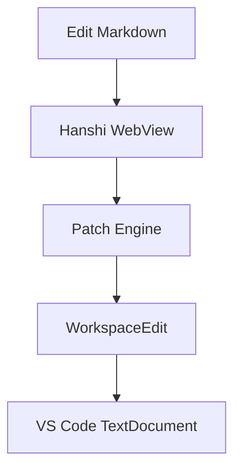

# Hanshi Full Coverage Sample

This file is intended for manual verification of the current Hanshi editor behavior.

Use it to check:

- block-aware persistence
- bidirectional sync
- Japanese IME input
- Mermaid preview
- Markdown structures commonly used in specification documents

## Paragraphs And Inline Formatting

Plain text paragraph.

This paragraph includes *emphasis*, **strong text**, ~~strikethrough~~, and `inline code`.

This paragraph includes a [standard link](https://example.com), an autolink <https://example.com/docs>, and an image reference placeholder: 

Japanese text sample: 日本語の文章、英数字 ABC123、句読点、全角スペースの確認。

## Headings

### Heading 3

#### Heading 4

##### Heading 5

###### Heading 6

## Lists

- Bullet item 1
- Bullet item 2
  - Nested bullet
  - Nested bullet with `code`
- Bullet item 3

1. Ordered item 1
2. Ordered item 2
3. Ordered item 3

- [x] Completed task
- [ ] Pending task
- [ ] Task with a [link](https://example.com/task)

## Blockquote

> Specification notes can live in blockquotes.
>
> They may span multiple paragraphs.
>
> - They can also contain lists
> - and inline formatting like **bold text**

## Divider

---

## Table

| Area | Status | Notes |
| --- | --- | --- |
| Sync | Done | Block-aware targeted replacement |
| IME | In Progress | Needs more real-world validation |
| Mermaid | Done | Preview is post-processed |

## Code Blocks

```ts
export function sum(a: number, b: number): number {
  return a + b;
}
```

```json
{
  "name": "hanshi",
  "editor": true,
  "docsAsCode": true
}
```

## Mermaid



## Math

Inline math: $E = mc^2$

Block math:

$$
\int_0^1 x^2 \, dx = \frac{1}{3}
$$

## Mixed Content

1. Start with an ordered list item.
2. Continue with nested content:
   - nested bullet
   - nested bullet with **strong text**

   ```bash
   bun run build
   ```

3. Finish with a concluding item.

## Escaping

Literal characters that often need escaping:

- \*asterisk\*
- \[brackets\]
- \`backticks\`

## Final Paragraph

If this file round-trips cleanly and remains readable in git diff, the current Hanshi persistence path is behaving reasonably well.
